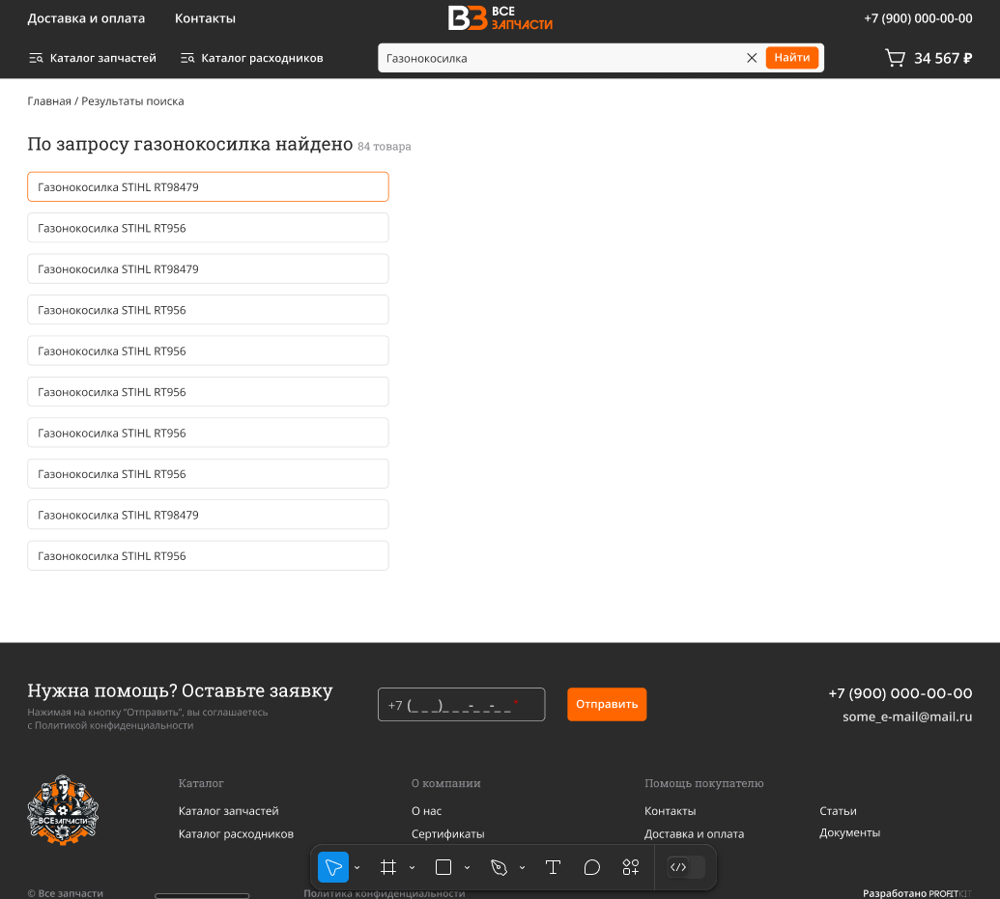

я использую BEM методологию в названиях классов

 - я опираюсь на этот макет при верстке 
 - я хочу сделать такой же слайдер
 - я хочу сделать такой же input с номером
 - адаптив для гланой страницы на телефоны
 - страница с поиском
https://www.figma.com/design/liyU9LV9j5hsTXmx870OmQ/запчасти-(Copy)?node-id=507-6756&t=XiMVkNg00GbpQcTG-0 - макет
```